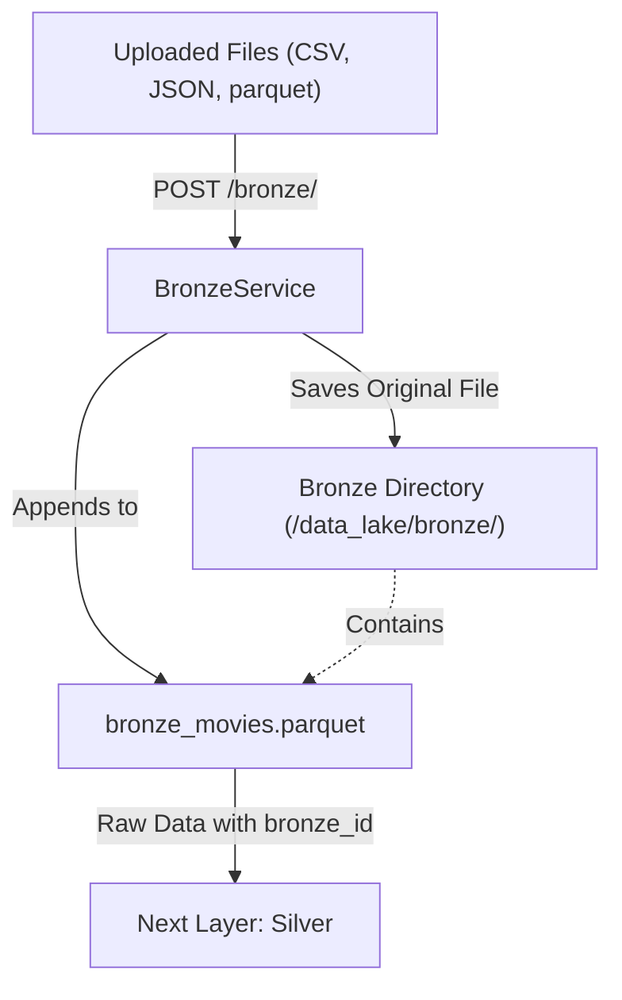
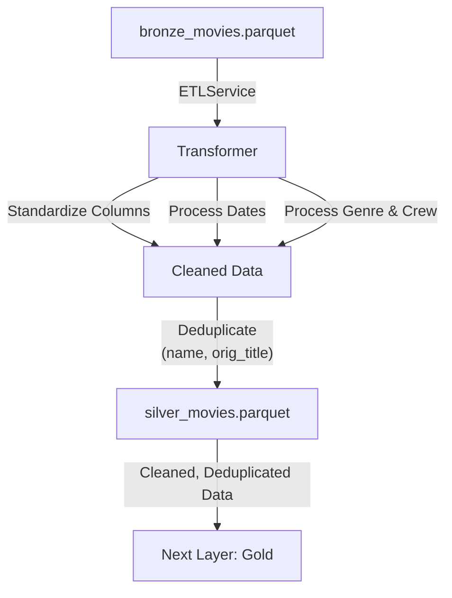
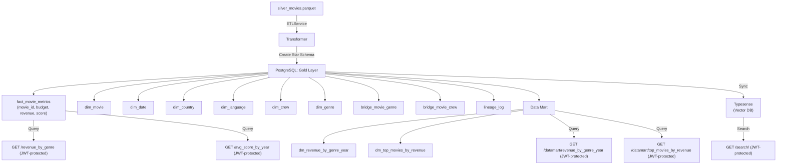
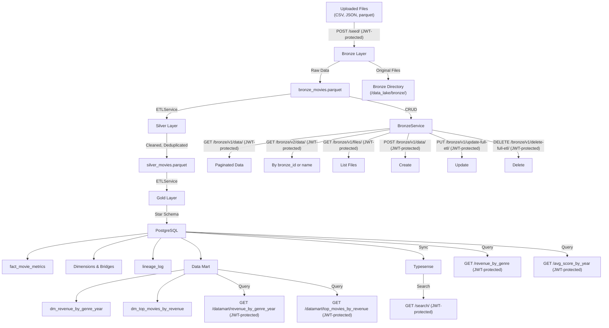

## Diagram for the Bronze Layer

The Bronze layer is the raw data layer, storing unprocessed data as `bronze_movies.parquet` and retaining original uploaded files (e.g., `CSV`, `JSON`, `parquet`) in the same directory for auditing and lineage.

### Explanation:

- **Uploaded Files**: Users upload files via the `/bronze/` endpoint.
- **BronzeService**: Handles the ingestion, saving the original file and appending data to `bronze_movies.parquet`.
- **Bronze Directory**: Stores both the original files and `bronze_movies.parquet`.
 - **Flow**: Data is ingested, stored as-is, and prepared for the next layer (Silver).

## Diagram for the Silver Layer

The Silver layer processes data from the Bronze layer, performing cleaning and deduplication based on `name` and `orig_title`, and stores the result as `silver_movies.parquet`.

## Explanation:

- **bronze_movies.parquet**: The raw data from the Bronze layer.
- **ETLService/Transformer**: Processes the data by standardizing columns, processing dates, and handling genres and crew.
- **Deduplication**: Ensures uniqueness based on `name` and `orig_title`.
- **silver_movies.parquet**: Stores the cleaned, deduplicated data, ready for the Gold layer.

## Diagram for the Gold Layer

The Gold layer structures the data into a star schema in PostgreSQL, with fact, dimension, and bridge tables, and syncs with Typesense for search.

## Explanation:

- **silver_movies.parquet**: The cleaned data from the Silver layer.
- **ETLService/Transformer**: Transforms the data into a star schema.
- **PostgreSQL (Gold Layer)**: Stores the structured data in fact, dimension, and bridge tables.
- **Typesense**: Syncs with the Gold layer for search functionality.
- **Queries**: The Gold layer supports analytical queries and search endpoints.

## Diagram for the Overall Data Lake Organization
This diagram shows the organization and flow across all layers of the data lake, including the interaction with external systems (PostgreSQL, Typesense).

## Explanation:

- **Bronze Layer**: Stores raw data and original files.
- **Silver Layer**: Processes and deduplicates data.
- **Gold Layer**: Structures data in PostgreSQL and syncs with Typesense.
- **CRUD Operations**: `BronzeService` supports:
  - `/bronze/v1/data/` (GET) for paginated data.
  - `/v1/files/` (GET) to list files.
  - `/v1/data/` (POST) to create.
  - `/v1/update-full-etl/` (PUT) to update.
  - `/v1/delete-full-etl/` (DELETE) to delete.  
  - `/v2/data/` (GET) to fetch a single record by `bronze_id` or `name`.
- **Queries and Search**: The Gold layer supports analytical queries and search via Typesense.
All endpoints are now JWT-protected.

