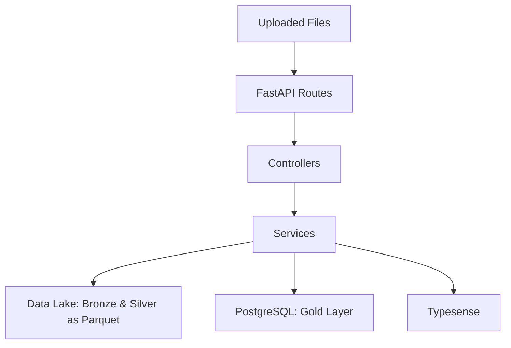

# Data Pipeline for Business Analytics

A data engineering project that implements an ETL pipeline, data lake, data warehouse, vector database, and REST API for movies business analysis.

## Architecture
- **PostgreSQL**: Hosts the Gold layer in a data warehouse with a star schema, storing fact and dimension tables (e.g., `fact_movie_metrics`, `dim_movie`) for efficient querying, and a Data Mart with materialized views for revenue analytics.
- **Typesense**: Vector database providing fast search capabilities for movie entities, synced with the Gold layer.
- **FastAPI**: REST API for data seeding, querying, and CRUD operations, secured with JWT authentication.
- **Data Lake**: Medallion architecture with:
  - **Bronze Layer**: Raw, unprocessed data stored as Parquet files (e.g., `bronze_movies.parquet`) and original uploaded files (e.g., CSV, JSON, parquet), preserved as-is for lineage and auditing.
  - **Silver Layer**: Cleaned, deduplicated data stored as Parquet files (e.g., `silver_movies.parquet`), processing only new, unique records.
  - **Gold Layer**: Structured data in a star schema, stored in PostgreSQL, with lineage tracking.

### Architecture Overview

This diagram illustrates the high-level data flow through the movies data pipeline:


## Dataset

This project uses the "IMDB movies dataset" from Kaggle, available at: https://www.kaggle.com/datasets/ashpalsingh1525/imdb-movies-dataset

## Project Structure

This project is a movie data pipeline built with FastAPI, PostgreSQL, and Typesense. Click below to view the directory structure:

### Key Design Notes:
- **Incremental Processing:** Only new data is processed from bronze to silver and gold. Existing movies in `bronze_movies.parquet` are not reprocessed unless updated via a PUT operation.
- **Deduplication in Silver:** The silver layer deduplicates data based on `name` and `orig_title`, ensuring only unique records flow to gold. Original files in bronze remain untouched.
- **Data Flow:** Data moves from bronze (raw) -> silver (cleaned, deduplicated) -> gold (structured star schema in PostgreSQL), with Typesense syncing from gold for search.
- **Authentication:** JWT (JSON Web Token) authentication is implemented to secure API endpoints, using a hardcoded user for simplicity (configurable via environment variables).
- **Data Mart**: Implemented with materialized views (`dm_revenue_by_genre_year`, `dm_top_movies_by_revenue`) in PostgreSQL for optimized revenue analytics, refreshed via the ETL pipeline.


<summary>View Directory Structure</summary>

```plaintext
src/
├── movies_data_pipeline/           # Main app directory
│   ├── api/                        # FastAPI API layer
│   │   ├── routes/                 # API endpoints
│   │   │   ├── auth.py             # JWT authentication routes
│   │   │   ├── crud.py             # CRUD routes (v1 and v2)
│   │   │   ├── datamart.py         # Data Mart routes
│   │   │   ├── gold.py             # Gold layer queries
│   │   │   ├── search.py           # Search routes
│   │   │   └── seed.py             # Seeding routes
│   │   └── main.py                 # FastAPI entry point
│   ├── config/                     # Configuration files
│   │   └── auth.py                 # JWT configuration
│   ├── controllers/                # Business logic
│   │   ├── crud_controller.py      # CRUD operations (v1 and v2)
│   │   ├── datamart_controller.py  # Data Mart queries
│   │   ├── gold_controller.py      # Gold layer queries
│   │   ├── search_controller.py    # Search logic
│   │   └── seed_controller.py      # Seeding logic
│   ├── services/                   # Data processing services
│   │   ├── auth_service.py         # JWT authentication logic
│   │   ├── bronze_service.py       # Bronze layer operations
│   │   ├── datamart_service.py     # Data Mart refresh logic
│   │   ├── etl_service.py          # ETL pipeline coordinator
│   │   ├── extractor_service.py    # Data extraction
│   │   ├── initialize_service.py   # Schema initialization
│   │   ├── loader_service.py       # Data loading
│   │   ├── search_service.py       # Search logic
│   │   ├── search_service_adapter.py # Typesense integration
│   │   ├── transformer_service.py  # Data transformation
│   │   └── truncate_loader_service.py # Truncate-and-load for gold
│   ├── data_access/                # Data layer
│   │   ├── data_lake/              # Data lake
│   │   │   ├── bronze/             # Raw data (Parquet + original files)
│   │   │   ├── silver/             # Cleaned data (Parquet)
│   │   │   └── gold/               # (Not used; gold in PostgreSQL)
│   │   ├── models/                 # SQLModel models
│   │   │   └── gold.py             # Gold layer table definitions
│   │   ├── database.py             # PostgreSQL connection
│   │   └── vector_db.py            # Typesense connection
│   ├── domain/                     # Domain logic
│   │   └── models/                 # Pydantic models
│   │       ├── bronze.py           # BronzeMovieUpdate model
│   │       └── movie.py            # Movie entity
├── .env                            # Environment variables
├── Dockerfile                      # FastAPI Dockerfile
├── Dockerfile.typesense            # Typesense Dockerfile
├── docker-compose.yml              # Docker Compose setup
├── pyproject.toml                  # Poetry dependencies
└── README.md                       # Documentation
```
### Overview of Key Components
| Directory         | Purpose                              |
|-------------------|--------------------------------------|
| `api/`            | FastAPI routes for seeding, querying, and partial CRUD. |
| `config/`         | Configuration settings (e.g., JWT). |
| `controllers/`    | Logic for API endpoints.           |
| `services/`       | ETL pipeline, bronze operations, and search services. |
| `data_access/`    | Data lake, PostgreSQL, and Typesense connections. |
| `domain/`         | Pydantic-defined domain entities.      |

##  Architecture Details

### The ETL pipeline is modular and follows the medallion architecture:

- **Extractor:** Ingests raw data into the bronze layer as bronze_movies.parquet, appending new records with sequential bronze_ids. Original files (e.g., CSV, JSON) are stored in the bronze directory unchanged.
- **Transformer:** Processes only new data from bronze to silver, deduplicating based on name and orig_title. Transforms silver data into gold-layer star schema tables.
- **Loader:** Loads gold tables into PostgreSQL, mapping lineage IDs to database-generated IDs, with a lightweight deduplication safety net.
- **SearchServiceAdapter:** Syncs Typesense with the gold layer for search functionality.
- **ETLService:** Orchestrates the pipeline, processing only new files and triggering Typesense sync.
- **BronzeService:** Handles bronze operations (seeding, partial CRUD), ensuring updates occur only via explicit PUT requests.
- **AuthService:** Implements JWT authentication with a hardcoded user (configurable via `.env`).
- **DataMartService:** Refreshes Data Mart materialized views (`dm_revenue_by_genre_year`, `dm_top_movies_by_revenue`) after Gold layer updates.


### Deduplication Strategy:

- Bronze retains all raw data, including duplicates, for auditing and lineage.
- Silver deduplicates incrementally, processing only new records and keeping existing ones unless updated via PUT.
- Gold inherits deduplicated data, structured into a star schema in PostgreSQL.

## Data Lake Structure

- **Bronze Layer:** Raw data stored as `bronze_movies.parquet`, with original files (e.g., `imdb_movies_20250406.csv`) retained in the same directory.
- **Silver Layer:** Cleaned, deduplicated data as `silver_movies.parquet`, with fields like `genre_list` and `crew_pairs` processed for gold.
- **Gold Layer (PostgreSQL):** Star schema with: 
  - **Fact Table:** `fact_movie_metrics` (e.g., `movie_id`, `budget`, `revenue`, `score`).
  - **Dimension Tables:** `dim_movie`, `dim_date`, `dim_country`, `dim_language`, `dim_crew`, `dim_genre`.
  - **Bridge Tables:** `bridge_movie_genre`, `bridge_movie_crew` for many-to-many relationships.
  - **Aggregates:** `revenue_by_genre`, `avg_score_by_year`.
  - **Lineage:** `lineage_log` for tracking transformations.
- **Data Mart (PostgreSQL):** Materialized views for revenue analytics:
  - `dm_revenue_by_genre_year`: Revenue by genre and year, refreshed via ETL.
  - `dm_top_movies_by_revenue`: Top 10 movies by revenue, refreshed via ETL.

## REST API Endpoints

- **POST** `/auth/token`: Authenticates a user and returns a JWT token (uses hardcoded credentials from `.env`).
- **POST** `/seed`: Uploads a file (`CSV` or `JSON`) to seed data into bronze, appending to `bronze_movies.parquet` and storing the original file with a timestamp.
- **GET** `/search/`: Searches movies in Typesense by query and optional genre filter, with pagination (`limit`, `offset`).
- **GET** `/revenue_by_genre`: Retrieves total revenue by genre from PostgreSQL.(JWT-protected)
- **GET** `/avg_score_by_year`: Retrieves average score by year from PostgreSQL.(JWT-protected)
- **GET** `/datamart/revenue_by_genre_year`: Revenue aggregated by genre and year from materialized view. (JWT-protected)
- **GET** `/datamart/top_movies_by_revenue`: Top 10 movies by revenue from materialized view. (JWT-protected)
- **GET** `/bronze/v1/data/`: Fetches paginated bronze data(`page`, `page_size`).
- **GET** `bronze/v2/data/`: Fetches bronze data by `bronze_id` or `name`.
- **GET** `/bronze/v1/files/`: Lists bronze files (excludes `bronze_movies.parquet`).
- **POST** `/bronze/v1/data/`: Creates new bronze records (single `JSON` object or an array of `JSON` objects)
- **PUT** `/bronze/v1/update-full-etl/`: Updates bronze records by `bronze_id` (single JSON object or array of JSON objects, `bronze_id` mandatory). Updates the silver layer, deduplicating based on `name` and `orig_title` (considering two movies with the same `name` and `orig_title` as the same movie), then runs the full ETL process, truncating the gold layer and reloading it.
- **DELETE** `/bronze/v1/delete-full-etl/`: Deletes bronze records by `bronze_id` (single integer or array of integers). Deletes matching records from the silver layer (by `bronze_id` or falling back to `name` and `orig_title`), then runs the full ETL process, truncating the gold layer and reloading it.

## Setup and Running

- **Docker**: Use `docker-compose.yml` to run PostgreSQL, Typesense, and the FastAPI app.
- **Dependencies**: Managed via `pyproject.toml` with Poetry.

### Clone the repository:
```bash
git clone <repository-url>
cd <repository-directory>
```
### Build and start the services:
```bash
docker-compose up --build
```
### Access the services:

- FastAPI: http://localhost:8000
- PostgreSQL: accessible via SSH or pgAdmin (see below)

**API Authentication:**
- The FastAPI app uses JWT authentication with default credentials: `username: user` and `password: password`. Use these to obtain a token via `POST /auth/token` unless custom credentials are set in the `.env` file.

### Accessing the PostgreSQL Database

The Gold layer data in PostgreSQL can be accessed in two ways: via SSH into the postgres container or through an optional pgAdmin web interface. The pgAdmin service is included in docker-compose.yml but commented out by default for flexibility.

## Option 1: SSH into the PostgreSQL Container
### Start the services (if not already running):
```bash
docker-compose up -d
```
### Access the postgres container:
```bash
docker exec -it postgres_db bash
```
### Connect to the PostgreSQL database:
```bash
psql -U admin -d gold
```
### Use SQL commands to explore the database, e.g.:
```bash
\dt             -- List tables
SELECT * FROM revenue_by_genre;  -- View data
```
## Option 2: Use pgAdmin (Optional)
Open `docker-compose.yml` and uncomment the pgadmin service section:
```
# pgadmin:
#   image: dpage/pgadmin4:latest
#   container_name: pgadmin
#   environment:
#     PGADMIN_DEFAULT_EMAIL: admin@admin.com
#     PGADMIN_DEFAULT_PASSWORD: admin
#     PGADMIN_LISTEN_PORT: 80
#   ports:
#     - "8080:80"
#   depends_on:
#     postgres:
#       condition: service_healthy
#   volumes:
#     - pgadmin_data:/var/lib/pgadmin
#   networks:
#     - app_network
volumes:
  postgres_data:
  typesense_data:
  # pgadmin_data:
```
## Start the services:
```bash
docker-compose up -d --build
```
Open pgAdmin in your browser at http://localhost:8080.

**Log in with:**

- Email: admin@admin.com
- Password: admin

**Add a new server:**

**General Tab:**

- Name: postgres (or any name)

**Connection Tab:**

- Host: postgres (Docker service name)

- Port: 5432

- Database: gold

- Username: admin

- Password: password

## Project Status

This is stage of the project fulfils core requirements from the technical challenge:
- Medallion architecture with bronze (raw), silver (deduplicated), and gold (star schema) layers.
- Data lake using Parquet files for bronze and silver.
- Data warehouse in PostgreSQL with 1 fact table, 6+ dimension tables, and bridge tables.
- Typesense vector DB via Docker for fast search.
- FastAPI REST API with seeding and querying implemented, partial CRUD in progress.
- Pydantic domain models and SQLModel for gold tables.
- JWT authentication implemented to secure API endpoints, using a hardcoded user configurable via `.env`.
- Data Mart with materialized views (`dm_revenue_by_genre_year`, `dm_top_movies_by_revenue`) for revenue analytics, refreshed via ETL.

**Next Steps:**

- **Alembic:** I’ll add Alembic to handle database migrations for the PostgreSQL gold layer. As I expand the star schema—say, adding a `dim_studio` table or tweaking `fact_movie_metrics` —Alembic will keep the schema consistent and trackable, making updates smoother across dev and prod setups.

- **Celery with Redis:** To make my FastAPI app more responsive, I’ll bring in Celery with Redis as a task queue. Heavy lifting, like processing a big CSV upload to bronze via `/seed`, can run in the background. This keeps the API responsive for users, and I’ll use Flower as a dashboard to keep an eye on those tasks in real-time.

- **Task Status Endpoint:** I’ll add a new endpoint, like GET `/tasks/{task_id}`, to let users check on Celery jobs—think tracking the ETL for a bronze file upload. It’ll pull the task’s state (e.g., “processing,” “done”) and progress (e.g., “50% through deduplication”) from Celery, giving real-time feedback without clogging the API.

- **Redis Caching:** Since Redis is already in play for Celery, I’ll use it to cache frequent queries, like GET `/revenue_by_genre` or `/datamart/top_movies_by_revenue`. Storing results with a TTL (e.g., 1 hour) will cut down on PostgreSQL hits, speeding up responses for users pulling the same analytics repeatedly.

- **Airflow:** I want Airflow to take charge of scheduling the ETL flow—like kicking off daily bronze ingestion or refreshing the gold layer and Data Mart views. With DAGs and sensors watching for new files in the bronze folder, it’ll ensure the pipeline runs like clockwork, syncing Typesense for search as the final step.

**JSON Validators:** I’ll tighten up data coming into endpoints like POST `/seed` or PUT `/bronze/v1/update-full-etl` with JSON schema checks (probably via Pydantic). This catches bad data—like a missing name or invalid revenue—before it hits the pipeline, keeping bronze clean and downstream layers reliable.

**JWT with Private/Public Key:** I’ll upgrade JWT auth from a shared secret to RSA key pairs. For my `/auth/token` endpoint, this means generating tokens with a private key and verifying them with a public one—more secure and scalable if I ever split the API into microservices. It’s a small tweak with big wins: no key leaks, and easier trust between components.

## Considerations 

### Dataset Size and Loading Time:
- The IMDB movies dataset contains 10,000 records, which can slow down the ETL process, especially when syncing with Typesense for search functionality.

- Current Implementation: Batch processing is in place to handle data ingestion from bronze to silver to gold (PostgreSQL), and Typesense syncs by fetching crew, genre, language, and release_date data from PostgreSQL’s gold layer.

- Performance Concern: Fetching data from PostgreSQL for Typesense sync introduces overhead, as it queries the database after the gold layer is populated.

- Optimization Idea: Instead of querying PostgreSQL, pass the transformed DataFrames (used to populate `fact_movie_metrics`, `dim_crew`, `dim_genre`, etc.) directly to Typesense during the ETL process. This avoids redundant database calls and leverages in-memory Pandas operations for speed.

- Validation: Testing with a 6,000-record subset runs smoothly, suggesting the 10,000-record dataset is manageable with this tweak.

- Typesense Sync Optimization: Modify SearchServiceAdapter to accept DataFrames from `transformer_service.py` during ETL, bypassing PostgreSQL queries. For example, after transforming `silver_movies.parquet` into `dim_genre` and `bridge_movie_genre`, pass those DataFrames to Typesense for indexing.

### ETL Overhead on Updates and Deletes:
- Current Behavior: Both PUT `/bronze/v1/update-full-etl/` and DELETE `/bronze/v1/delete-full-etl/` trigger a full ETL run, truncating and reloading the entire gold layer in PostgreSQL (e.g., `fact_movie_metrics`, `dim_movie`). This is inefficient for a 10,000-record dataset, as it reprocesses unchanged data.

- Critique: Dropping and recreating the gold layer discards historical data and scales poorly with larger datasets or frequent updates.

- Alternative 1 - SCD2 : Model dimension tables (e.g., `dim_movie`, `dim_crew`) with SCD2 to track historical changes. Add columns like `valid_from`, `valid_to`, and `is_active` to preserve history without rebuilding the gold layer. Updates would append new rows rather than truncate, though this increases storage and query complexity.

- Alternative 2 - Enhance the gold layer’s lineage_log table to link gold records (e.g., `movie_id` in `fact_movie_metrics`) to `silver_id` from `silver_movies.parquet`. Use composite keys or additional constraints in key tables (e.g., `dim_movie`) to trace updates back to silver. This avoids full reloads by targeting only changed records, though it requires careful indexing for performance.

### Testing and Debugging Datasets:
- Current Approach: A 6,000-record subset works well for testing and debugging, balancing speed and coverage.
- Enhancement: Included sample datasets in the repo for convenience, as the full IMDB dataset on Kaggle requires login. Added a simple JSON file (7 records), a 6,000-record subset, and the full 10,000-record dataset to a utils/ folder.


Dataset Inclusion: Added utils/sample_10.json, utils/imdb_6k.parquet, and utils/imdb_10k.parquet to the repo, referenced in 
